# Finding Needle in Haystack

- [Finding Needle in Haystack](#finding-needle-in-haystack)
  - [Summary](#summary)
  - [2-Previous Design](#2-previous-design)
  - [3-Haystack design](#3-haystack-design)
    - [Haystack Directory](#haystack-directory)
    - [Haystack Cache](#haystack-cache)
    - [Haystack Store](#haystack-store)
      - [Photo Read](#photo-read)
      - [Photo Write](#photo-write)
      - [Photo Delete](#photo-delete)
      - [Index File](#index-file)
      - [Filesystem](#filesystem)
    - [Recovery from failures](#recovery-from-failures)
    - [Optimizations](#optimizations)
  - [4-Evaluation](#4-evaluation)
  - [Refs](#refs)

## Summary

problems with serving photos with NFS approach
1. wasted storage for not-used dir and file metadata (posix file system)
2. requires to load metadata into mem first to then load file itself from disk. This results in more disk IOs for file read.

solution
- building a custom storage system `haystack` that can reduce the amount of metadata per photo hence less disk IO to achive lower latency and higher throughput.
- use haystack to serve long-tail photos and CDN for popular photos.

result
- Haystack serves photos with less cost and higher throughput compared to previous design with NFS and NAS (Network Attached Storage).
- It is incrementally scalable.

design requirements
1. high throughput low latency
2. fault-tolerant
3. more cost-effective than building for NAS
4. simple

## 2-Previous Design

What did not work in NFS design?
1. CDN misses the long-tail requests (older, less common photos) - typical for Facebook photos usage - which result in high latency. This is bad for user experience. 
2. Caching all in CDN is not cost effective.
3. Having enough RAM to cache all the inodes (~256 bytes each) is also not cost effective.

<p align="center">
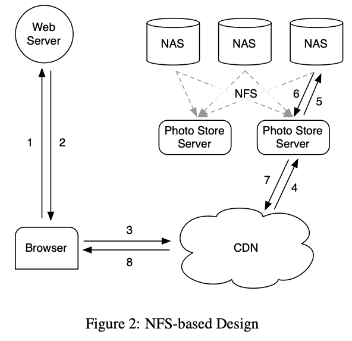
</p>

1 photo = 1 file = 1 inode = hundred of bytes

<p align="center">
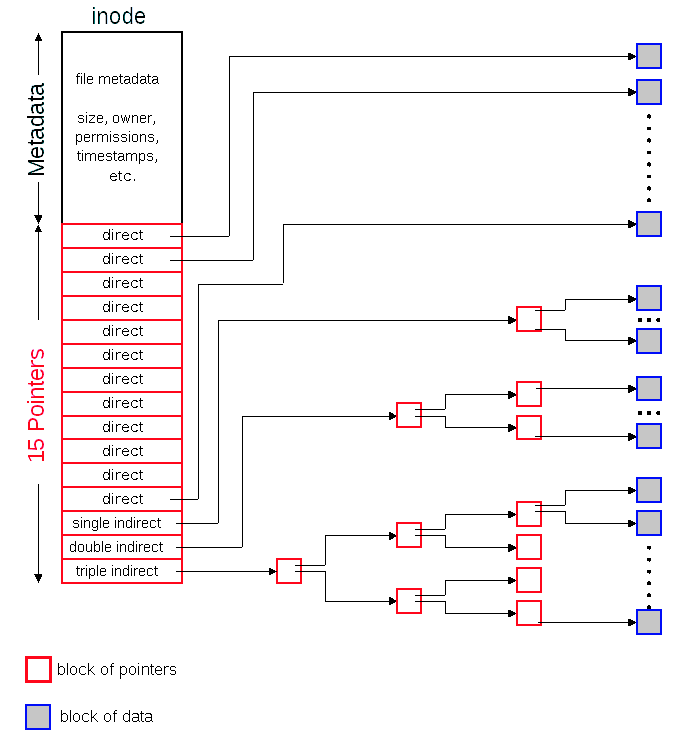
</p>

## 3-Haystack design

Haystack solves the solution by 
1. reducing the amound of metadata per photo to keep all the metadata in memory. 
2. storing multiple photos in a very large file to reduce metadata further.

This then reduces the disk operations that the storage systems need when doing a read. Using the typical POSIX inode design the amount of memory needed is `256 bytes * 2B * 1000 = 512TB` for metadata alone. 

System components
1. Store: persistent storage system, manages fs metadata for photos.
2. Directory: maintains logical to physical mapping and application metadata (how to construct the photo URL for app to access).
3. Cache: internal CDN provides shield `Store` against CDN failure and frequent requests.

<p align="center">

</p>

<p align="center">
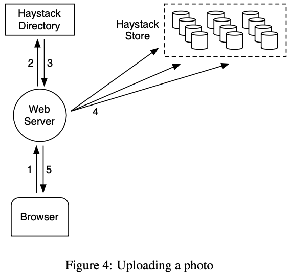
</p>

### Haystack Directory

```
http://<CDN>/<Cache>/<machine id>/<logical volume, photo>
```

### Haystack Cache

### Haystack Store

`Key design decision`: metadata operations (getting filename, location, offset, size) do not need disk IO.
- one Store machine manages many physical volumes
- Physical volume a very large file (100 GB) `/hay/haystack_<logical volume id>`
- one volume = millions of photos
- access photo (needle) using `(logical_vol_id, offset)`
- Store keeps 
  - `open file descriptors` for all volumes
  - in-mem mapping (photo_ids) -> fs_metadata(file, offset, size_in_bytes,...)


Design
- Fig 5 layout of haystack store file
- one needle = one photo
- Table 1 fields in each needle

<p align="center">
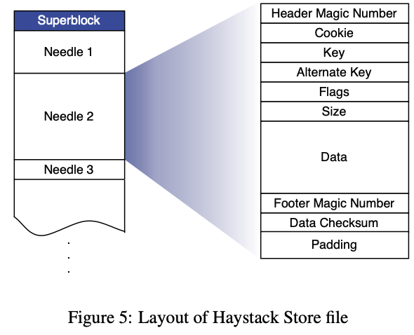
</p>
<p align="center">
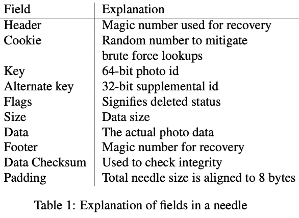
</p>

To get needle quickly
- each Store maintains in-mem data structure for each volume
- it maps (key, alternate key) -> (needle's flags, size in bytes, volume offset)
- Store machine reconstructs this from volume files after a crash before serving request


Detailed designs of
- photo read
- photo write
- photo delete
- index file
- filesystem

#### Photo Read

#### Photo Write

#### Photo Delete

#### Index File

Design decisions: async index updates to reduce write latency
1. write photo: sync append needle to volume, async append index
2. delete photo: async set flags in needle, not updating index

Side effects to be tackled
1. needles can exist without corresponding index records
2. index records do not reflect deleted photos

<p align="center">
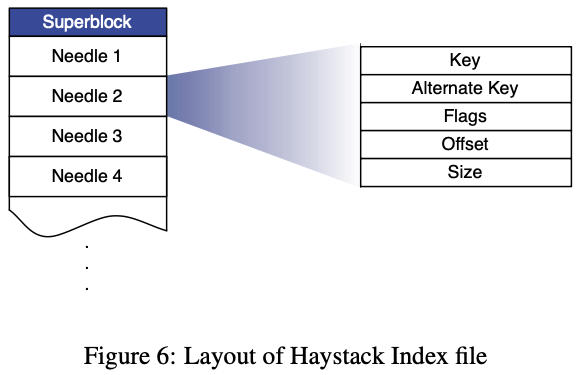
</p>

<p align="center">
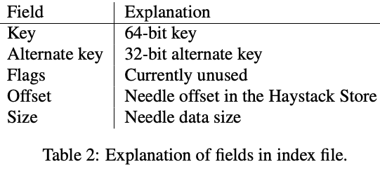
</p>

#### Filesystem

### Recovery from failures

Failures to tolerate: faulty hard drives, bad RAID controllers, bad motherboards, etc.

How?
1. detection
   1. background job `pitch-fork` periodically checks health of Store machines.
   2. mark read-only if any problem and alert for intervention.
2. repair: 
   1. investigate and fix offline or
   2. `bulk-sync` op to reset a Store machine using a replica

### Optimizations

1. compaction
2. reducing 20% mem footprints reduce
   - 10 bytes of memory/ photo (instead of 536 bytes of `xfs_inode_t` in Linux with 1 file/photo per inode metadata)
   - replacing delete flag by setting offset 0
   - not keeping track of cookies in memory
3. batch upload
   - because big sequential writes is more suitable for disks than small random writes.
   - applies well to Facebook because users usually upload entire albums instead of single pictures.
   - improvements of aggregating writes result below.


## 4-Evaluation

Contents
1. look at Facebook photo requests workload
2. show Directory effect
3. show Cache effect
4. show Store effect in synthetic and production workloads

Tools
- `randomio`
  - open-source multithreaded disk I/O program used to measure the raw capabilities of storage devices.
  - it issues random 64KB reads using direct IO to make sector aligned requests and reports max sustainable throughput.
  - to establish a baseline for read thruput.
- `haystress`
  - custom built multi-threaded program
  - used to eval Store machines on synthetic workloads
  - communicates with Store via HTTP just like Cache
  - assess max read and write throughput Store can maintain
  - issues random reads over large set of dummy images to reduce machine cache effect

Distribution
- Photos uploaded recent days have a lot of requests -> CDN and Haystack Cache are effective at serving these. 
- Photo requests has `long-tail`  up to 1600 days which cannot be served by caching.

<p align="center">
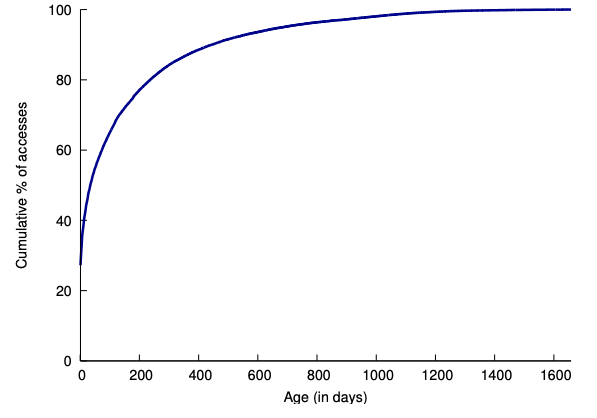
</p>

Traffic volume
- Haystack serves 10% (10B / 100B) of photo views.
- small images has 84% of view requests -> most requests serve small files so minimize metadata is important to reduce latency.

<p align="center">
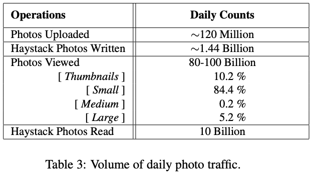
</p>

Haystack Directory: balances reads and writes across Store node well as shown in Fig 8.
<p align="center">
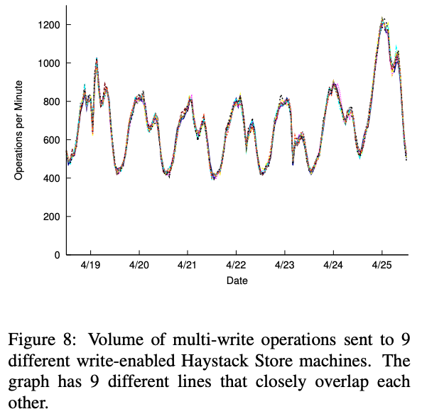
</p>

Haystack Cache: hit rate of 80% shows that it effectively reduces workloads for write-enabled Store.
<p align="center">
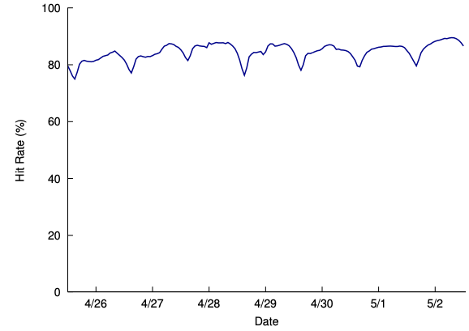
</p>

Haystack Store
- benchmarks need to show that Store can process random photos reads (long-tail side) with lower latency and higher throughput than previous NFS design.
- avg num images per multi-write request = 9.27
- only multi-write is allowed to amortized the write cost
- CPU utilization is low (idle 92-96%)

Fig10
- write-enabled nodes get more read requests (4500 ops/min) than read-only (1500 ops/min) because read and delete rates are high for recent photos
<p align="center">
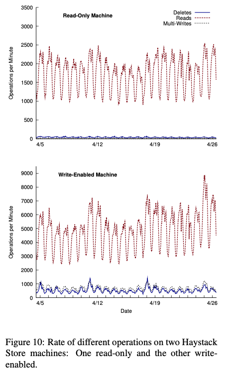
</p>

Fig11 prod avg latency of read and write nodes in fig10
- write latency is low at 1-2ms and stable even with spiky loads (3000-9000 ops/min)
- what enables stable write latency? NVRAM-backed raid controller buffer helps with async writes of needles (photos) and a single fsync for whole volume file
- read latency of read-only box is also stable despite the load variation
- read latency of write-enabled box has the shape because
  - read traffic increased as num photos stored increased
  - buffer-cache is more effective for read-only machine.
  - recently-written photos are read back immediately because FB highlights recent content.
<p align="center">
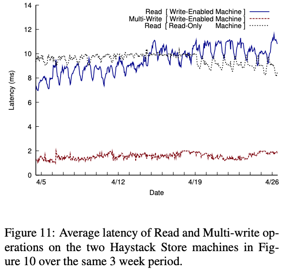
</p>

## Refs
- https://azrael.digipen.edu/~mmead/www/Courses/CS180/FileSystems-1.html

