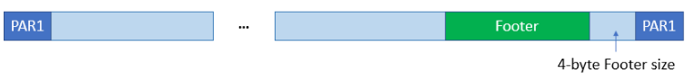
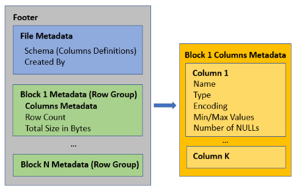

# Introduction
The question we want to answer in this blog is `WHY and HOW does Apache Spark use CRC`?

## Why
- to ensure data integrity after moving data between nodes (between Spark workers)
or between systems (Spark workers and object storage like AWS S3).

## Ensuring Data Integrity
many ways data can be corrupted while uploading or downloading between nodes, systems
  - memory errors on client or server computers, or router along the path
  - software bugs (e.g. in a used lib)
  - changes to the source file when upload/ download lasts long

`CRC32C` is recommended over `MD5` for data integrity check.


# Implementation
How
- Spark generates CRC files along the data files that support checksumming (Parquet, ORC, Avro).
  - 1 CRC file/ data file (parquet e.g.)
  - file name `.<datafilename>.crc`

- When Spark reads the data file, it also reads corresponding CRC file and validate checksum for each block.
If checksum value does not match, Spark knows that data is corrupted and raises error.
- Block = row group
- CRC32 produces a 4-byte checksum value


Why Spark generates extra CRC files while Parquet already has checksum in data file metadata?
- CRC in Parquet file metadata is only used to verify integrity of Parquet file itself (data blocks).
-> it does not guarantee that data store in Parquet as a whole is the same as original data used to create it.
- Spark stores checksum for the entire Parquet file.


Example
```
val data = Seq(
  (1, "apple", 2.99),
  (2, "banana", 1.99),
  (3, "orange", 0.99)
)
val df = sparkSession.createDataFrame(data).toDF("id", "name", "price")
// comment out coalesce(1) to write to 3 partitions
df
  .coalesce(1)
  .write
  .option("compression", "snappy")
  .parquet("parquet-one-partition")
```

CRC files created by Spark are separate one per parquet file.
CRC checksum of parquet is in footer of e.g. `part-00000-68d027c3-f55c-4aef-8854-37442413837b-c000.snappy.parquet`
```
parquet-one-partition
├── ._SUCCESS.crc
├── .part-00000-68d027c3-f55c-4aef-8854-37442413837b-c000.snappy.parquet.crc
├── _SUCCESS
└── part-00000-68d027c3-f55c-4aef-8854-37442413837b-c000.snappy.parquet

❯ hexdump .part-00000-f4cdf865-dd87-4edf-838e-98b752039c43-c000.snappy.parquet.crc
0000000 63 72 63 00 00 00 02 00 1b 8a c6 7a b5 a1 39 52
0000010


parquet-3-partition
├── ._SUCCESS.crc
├── .part-00000-f4cdf865-dd87-4edf-838e-98b752039c43-c000.snappy.parquet.crc
├── .part-00001-f4cdf865-dd87-4edf-838e-98b752039c43-c000.snappy.parquet.crc
├── .part-00002-f4cdf865-dd87-4edf-838e-98b752039c43-c000.snappy.parquet.crc
├── _SUCCESS
├── part-00000-f4cdf865-dd87-4edf-838e-98b752039c43-c000.snappy.parquet
├── part-00001-f4cdf865-dd87-4edf-838e-98b752039c43-c000.snappy.parquet
└── part-00002-f4cdf865-dd87-4edf-838e-98b752039c43-c000.snappy.parquet

❯ hexdump .part-00000-68d027c3-f55c-4aef-8854-37442413837b-c000.snappy.parquet.crc
0000000 63 72 63 00 00 00 02 00 42 73 a8 0c 96 28 2f 65
0000010

63 72 63 -> crc (hexadecimal representation of ASCII code)
00 00 00 02 00 -> beginning of crc32???
42 73 a8 0c 96 28 2f 65 -> 4-byte crc checksum value?? here it's 8 Byte

```


# Reference
- [Validating data integrity - Google Cloud Storage](https://cloud.google.com/storage/docs/hashes-etags)
- [File Checksum Feature for Validating Data Transfer - GCS](https://cloud.google.com/blog/products/storage-data-transfer/new-file-checksum-feature-lets-you-validate-data-transfers-between-hdfs-and-cloud-storage)
- [Parquet Checksumming](https://parquet.apache.org/docs/file-format/data-pages/checksumming/)
- [Github apache/parquet-mr TestDataPageV1Checksums.java](https://github.com/apache/parquet-mr/blob/master/parquet-hadoop/src/test/java/org/apache/parquet/hadoop/TestDataPageV1Checksums.java)


# Appendix
## Concepts
- Data Integrity: the overall accuracy, completeness, and consistency of data.

## Apache Parquet
How does Parquet support checksum?
- by `metadata footer` containing
  - schema
  - row groups
  - column statistics


Source: [Parquet 1.x Footer Content](http://cloudsqale.com/2021/01/15/parquet-1-x-file-format-footer-content/)


Parquet File Format

- parquet file content starts and ends with 4-byte PAR1 “magic” string
- before the ending PAR1 there is 4-byte footer length size (little-endian encoding)
- footer position: `FileLength - FooterLength - 4`


Parquet Footer Structure

- Footer encoded using Thrift protocol, contains: `file metadata` + `block metadata`
- column statistics (min/ max) available per block (row group)
- no statistics per file
- requires iteration over metadata of all blocks in footer to know file statistic for a column
  (e.g. min/max for skipping pushdown predicate). 
  File can be skipped only if all blocks can be skipped.

