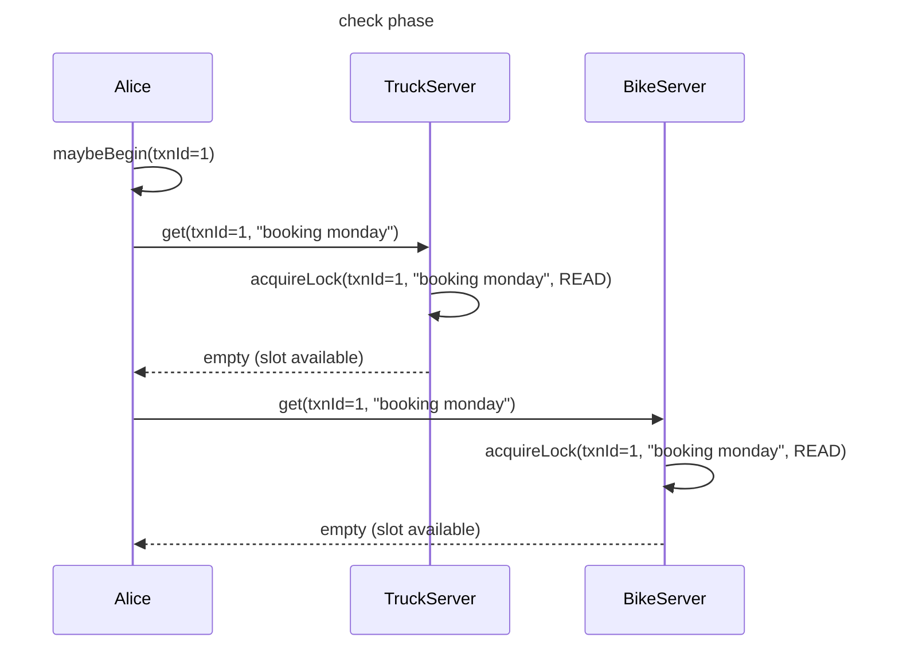
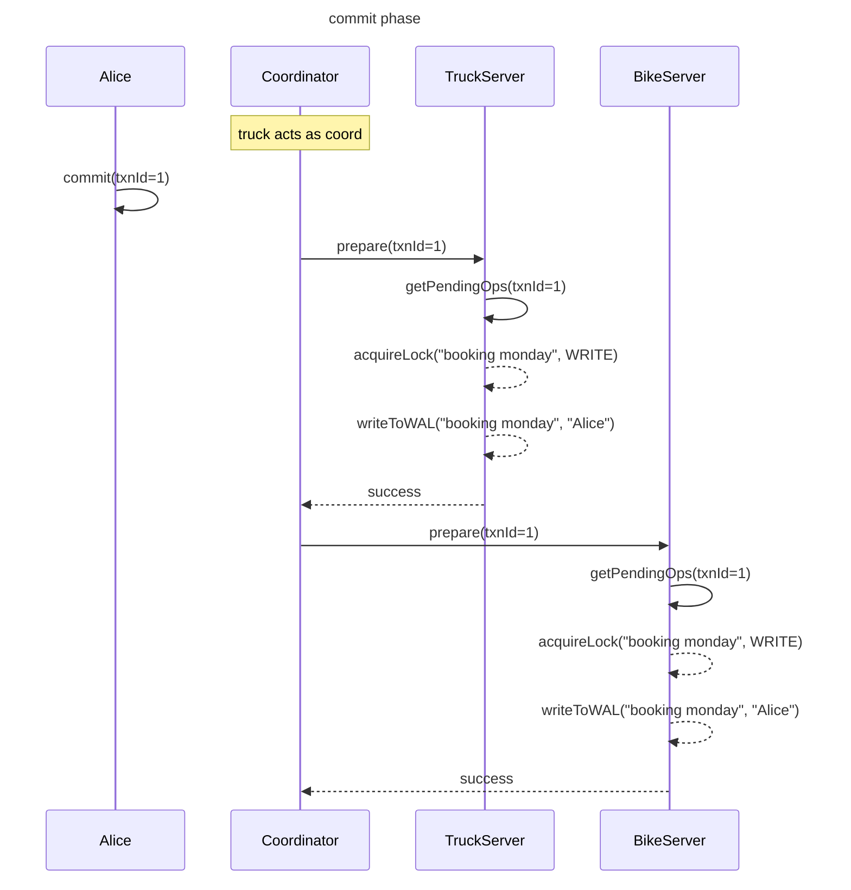
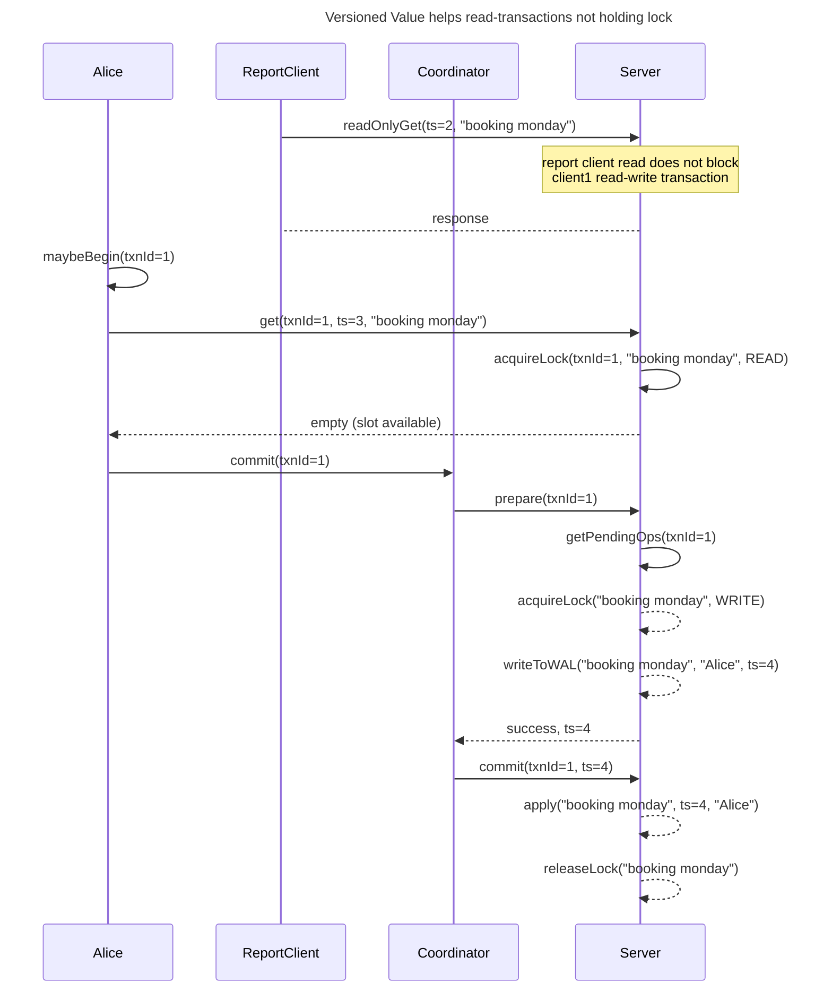

# Introduction
Today I learned about the `Two Phase Commit` pattern to achieve distributed transactions in Distributed Systems.
Problem
- data needs to be `atomically` stored on multiple cluster nodes.

To note
1. what happens if coordinator fails?
2. what happens if participant fails?

two phase commit
1. prepare phase
2. commit phase

Issues: conflicting transactions
- Solution: throwing exception in prepare step (commit phase) if seeing conflicting `read lock` while acquiring `write lock`

Issue: read-only transactions holding lock causing bad performance
- Solution: `Versioned Value` = storing multiple versions of values





## MVCC

1. read requests issued, holds a lock
2. all cluster nodes store kv at commit timestamp



```java
// MVCC using Lamport clock
class MvccTransactionalStore {
  public String readOnlyGet(String key, long readTimestamp) {
    adjustServerTimestamp(readTimestamp);
    return kv.get(new Versionedkey(key, readTimestamp));
  }
  
  
}

```

## Cockroachdb Approach

TODO

## Dynamodb Approach

Shopping cart example

``` 
TransactWriteItems(
    Check(table=customer, key=susie, exists)
    Check(table=inventory, key=book-99, amount>=5)
    Put(table=orders, key=newGUID(), customer=susie, product=book-99, copies=5,..)
    Update(table=inventory, key=book-99, amount-5)
)
```

Under the hood
- tx coordinator executes a `two phase commit`
- `prepare phase` checks the conditions e.g. check customer exists above
- `commit phase`
    - coordinator tries as hard as possible to commit the txn
    - if there is timeout in commit request -> resending to storage node until success
    - commit request is idempotent. can be retries by any coord
    - in case one failed -> coord sends release requests to rollback txn

fault tolerance, recovery
- multiple coordinators
- ledger for checkpointing `txn state`

serializability
- `timestamp ordering`
- assign timestamp to each txn = value of coord current clock
- time-drift between coords problem?

---
how a normal request routed


how a transact request routed


## Refs
- [USENIX ATC '23 - Distributed Transactions at Scale in Amazon DynamoDB](https://www.youtube.com/watch?v=3OpEIMR-ml0)
- [22 - Distributed Transactional Database Systems (CMU Intro to Database Systems / Fall 2022)](https://www.youtube.com/watch?v=yu2TZF7S1Mg)
